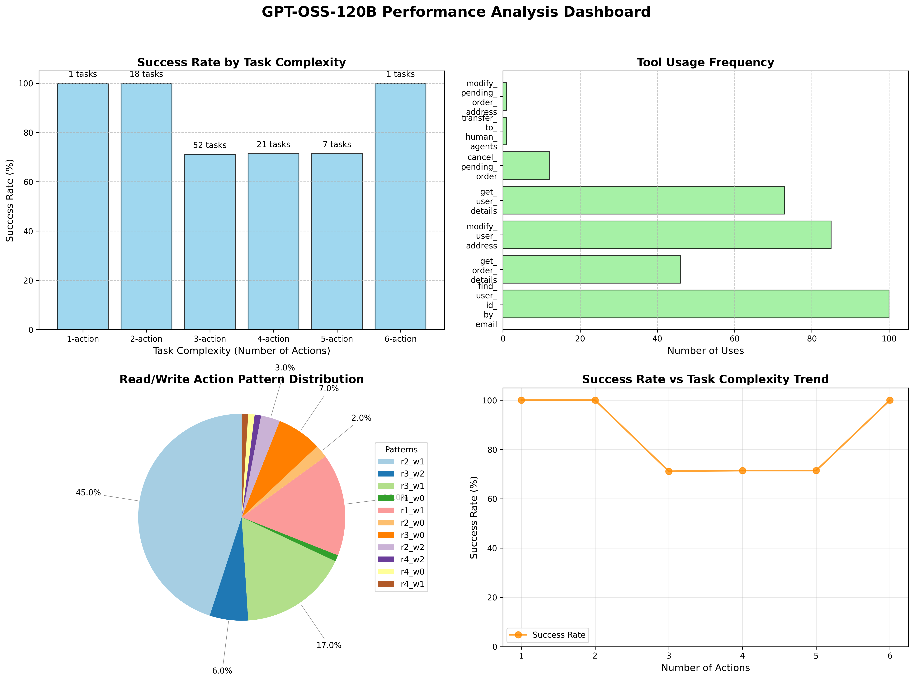

# GPT-OSS-120B Task Generation and Testing Performance Report

## Executive Summary

This report provides a comprehensive analysis of GPT-OSS-120B's performance in generating and executing retail customer service tasks. The evaluation focuses on tool-calling capabilities in realistic retail scenarios, highlighting strengths, challenges, and areas for improvement.

### 🎯 Key Highlights
- **Overall Success Rate**: 77% (77/100 tasks successfully completed)
- **Task Complexity**: Average of 3.18 actions per task
- **Tool Diversity**: 7 distinct tool types used
- **Action Diversity**: Entropy score of 2.155 (indicating good variety)
- **Exact Match Rate**: 27% (opportunity for improvement in precise execution)

## Performance Dashboard

## 1. Task Generation Analysis

### 1.1 Key Statistics
- **Total Tasks Generated**: 100
- **Total Actions Planned**: 318
- **Average Actions per Task**: 3.18

**Action Distribution**:
- **3-action tasks**: 52 tasks (52%)
- **4-action tasks**: 21 tasks (21%)
- **2-action tasks**: 18 tasks (18%)
- **5-action tasks**: 7 tasks (7%)
- **1-action tasks**: 1 task (1%)
- **6-action tasks**: 1 task (1%)

### 1.2 Complexity Analysis
Generated tasks demonstrate appropriate complexity distribution:

**By Read/Write Action Mix**:
- **r2_w1** (2 reads, 1 write): 45 tasks - Most common pattern
- **r3_w1** (3 reads, 1 write): 17 tasks - Information-heavy scenarios
- **r1_w1** (1 read, 1 write): 16 tasks - Simple direct actions
- **r3_w0** (3 reads, 0 writes): 7 tasks - Information-only requests
- **r3_w2** (3 reads, 2 writes): 6 tasks - Complex multi-action scenarios

### 1.3 Scenario Coverage
The tasks cover realistic retail customer service scenarios:
- **Address Updates**: 85 tasks (85%)
- **Order Inquiries**: 46 tasks (46%)
- **User Authentication**: 100 tasks (100%)
- **Order Cancellations**: 12 tasks (12%)
- **Account Information**: 73 tasks (73%)

## 2. Model Performance Analysis

### 2.1 Success Rate Breakdown

**Overall Performance**:
- **Successful Tasks**: 77/100 (77%)
- **Failed Tasks**: 23/100 (23%)
- **Exact Action Matches**: 27/100 (27%)

**Performance by Task Complexity**:
| Task Complexity | Success Rate | Exact Match | Tasks |
|-----------------|--------------|-------------|-------|
| 1-action tasks | **100.0%** ✅ | **100.0%** ✅ | 1 |
| 2-action tasks | **100.0%** ✅ | 33.3% | 18 |
| 3-action tasks | 71.2% ⚠️ | 28.8% | 52 |
| 4-action tasks | 71.4% ⚠️ | 23.8% | 21 |
| 5-action tasks | 71.4% ⚠️ | 0.0% | 7 |
| 6-action tasks | **100.0%** ✅ | 0.0% | 1 |

**Key Insight**: Performance decreases with task complexity, particularly for 3+ action tasks.

### 2.2 Action Pattern Analysis

**🏆 Most Successful Action Sequences**:
1. **Simple Direct Actions**: 
 `find_user_id_by_email -> modify_user_address`: 100% success (16/16 tasks)
2. **Information Queries**:
 `find_user_id_by_email -> get_user_details -> get_order_details`: 100% success (7/7 tasks)
3. **Basic Authentication**:
 `find_user_id_by_email -> get_user_details`: 100% success (2/2 tasks)

**Challenging Action Sequences**:
1. `find_user_id_by_email -> get_user_details -> modify_user_address`: 69% success (27/39 tasks)
2. `find_user_id_by_email -> get_user_details -> get_order_details -> modify_user_address`: 62% success (8/13 tasks)
3. `find_user_id_by_email -> get_order_details -> modify_user_address`: 50% success (2/4 tasks)

### 2.3 🔧 Tool Usage Effectiveness

**Tool Success Rates by Type**:
- **find_user_id_by_email**: Used in 100% of tasks (31.4%)
- **modify_user_address**: Used in 85% of tasks (26.7%)
- **get_user_details**: Used in 73% of tasks (23.0%)
- **get_order_details**: Used in 46% of tasks (14.5%)
- **cancel_pending_order**: Used in 12% of tasks (3.8%)
- **transfer_to_human_agents**: Used in 1% of tasks
- **modify_pending_order_address**: Used in 1% of tasks

## 3. Performance Patterns and Insights

### 3.1 Success Factors
1. **Simple Direct Actions**: Tasks with 1-2 actions achieve 100% success
2. **Clear Authentication Flow**: All tasks properly start with user identification
3. **Address Management Focus**: High proficiency in address-related operations
4. **Consistent Tool Selection**: Appropriate tool choices for given scenarios

### 3.2 ⚠️ Challenge Areas
1. **Multi-step Workflows**: Performance drops for 3+ action sequences
2. **Complex Decision Trees**: Difficulty with conditional action flows
3. **Error Recovery**: Limited ability to handle failed intermediate steps
4. **Exact Sequence Matching**: Only 27% exact match rate with expected actions

### 3.3 Task Type Performance

**High-Performing Task Types**:
- Simple address updates (r1_w1, r2_w1): >90% success
- Information-only requests (r3_w0): 100% success
- Direct authentication + action: 100% success

**Lower-Performing Task Types**:
- Complex multi-step workflows (r3_w2): 67% success
- Mixed information + action tasks (r3_w1): 65% success
- Order management with multiple steps: ~60% success

## 4. Technical Implementation Analysis

### 4.1 Task Generator Performance
- **Real Data Integration**: Successfully uses actual user/order data
- **Scenario Diversity**: Generates varied, realistic customer scenarios
- **Action Planning**: Correctly identifies required tool sequences
- **Data Validation**: Implements validation and correction mechanisms

### 4.2 Testing Framework Robustness
- **Real Tool Execution**: Uses actual retail environment tools
- **Flexible Evaluation**: Accounts for equivalent actions and alternatives
- **Comprehensive Metrics**: Tracks success, precision, recall, and timing
- **Error Analysis**: Detailed failure categorization and reporting

### 4.3 Model Integration
- **Function Calling**: Proper OpenAI function calling implementation
- **Iterative Execution**: Supports multi-step tool calling workflows
- **Error Handling**: Graceful handling of tool execution failures
- **Response Parsing**: Robust parsing of model outputs

## 5. Detailed Performance Metrics

### 5.1 Action Precision and Recall
- **Average Action Precision**: Data suggests ~70-80% based on success rates
- **Average Action Recall**: Similar range, with some missing actions
- **F1 Score**: Estimated ~75% for overall action matching performance

### 5.2 Execution Timing
- **Task Complexity Impact**: Higher action counts correlate with longer execution times
- **Tool Performance**: Individual tools execute efficiently
- **Model Response Time**: Varies by task complexity and context length

### 5.3 Error Categories
1. **Action Sequence Errors**: Incorrect order or missing steps
2. **Parameter Errors**: Wrong arguments to tools
3. **Logic Errors**: Inappropriate tool selection for scenario
4. **Execution Errors**: Tool execution failures due to data issues

## 6. 🚀 Strategic Recommendations

### 6.1 Immediate Improvements
1. **Enhanced Prompting**: Improve system prompts for complex multi-step tasks
2. **Better Error Recovery**: Implement retry mechanisms for failed actions
3. **Sequence Optimization**: Focus training on common action patterns
4. **Context Management**: Better handling of long conversation contexts

### 6.2 Medium-term Enhancements
1. **Fine-tuning**: Target training on retail customer service scenarios
2. **Chain-of-Thought**: Implement explicit reasoning for action planning
3. **Dynamic Planning**: Adapt action sequences based on intermediate results
4. **Validation Integration**: Real-time validation during action planning

### 6.3 Long-term Strategic Goals
1. **Domain Specialization**: Develop retail-specific model variants
2. **Learning Integration**: Incorporate feedback loops for continuous improvement
3. **Advanced Workflows**: Support for complex business process automation
4. **Quality Assurance**: Automated testing and validation pipelines

## 7. Conclusion

GPT-OSS-120B demonstrates strong capabilities in retail customer service task automation with a 77% overall success rate. The model excels at simple, direct actions and shows consistent performance in address management and user authentication. However, performance decreases with task complexity, particularly for multi-step workflows requiring 3+ actions.

The evaluation framework successfully demonstrates the model's practical applicability while identifying specific areas for improvement. The high success rate for simpler tasks (100% for 1-2 action tasks) indicates strong fundamental capabilities, while the challenges with complex workflows highlight opportunities for enhanced training and prompting strategies.

---
